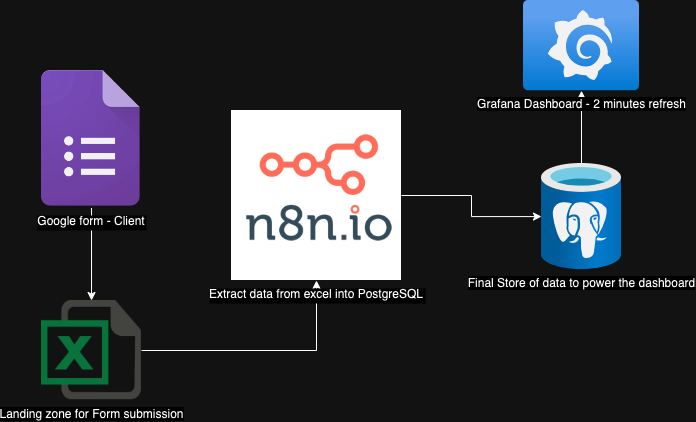

# Election Results Collation - POC

## Description
A pipeline to handle the secure and timely transmission of the Election results. This is the proof of Concept of the idea. In an election in Ghana, voting is done at the polling stations within Districts in the various contituencies in the regions. Each polling station has a polling agent who is a representative of a political party. 
Hence this system is to be used by the political parties through authentication on google forms to submit the election results once voting ends at the polling station. The design is to have the results aggregated in near real-time. 
The n8n application is a low-code platform for performing ETL processes which seamlessly connects to the Google Workspace (Google Sheets, Looker, etc) together with other tools such as Postgresql. Hence it is used to setup a trigger on the Google Sheet that receives the form submissions. Once a response hits the form, a job is triggered in n8n to process the data and insert into PostgreSQL database. With the periodic refresh functionality of Grafana dashboard, a dashboard is built on the data from PostgreSQL. 

## Tools
* Google Forms
* Google Sheets
* n8n.io 
* PostgreSQL
* Granfana Dashboard

## Links 
[Google Forms for Votes Submission](https://forms.gle/FFBo4AGP6rAvGvQ7A)

[Grafana Public Dashboard](https://pocgrafana.fly.dev/public-dashboards/3b06f43deab74623854123eb2ad98444?orgId=1&refresh=10s)

[n8n ETL Tool](https://electionpocn8n.fly.dev/)

## Deployment
* The test deployment is on Fly.io for the POC, which includes n8n.io self hosting, PostgreSQL Database, Grafana Dashboard. 

